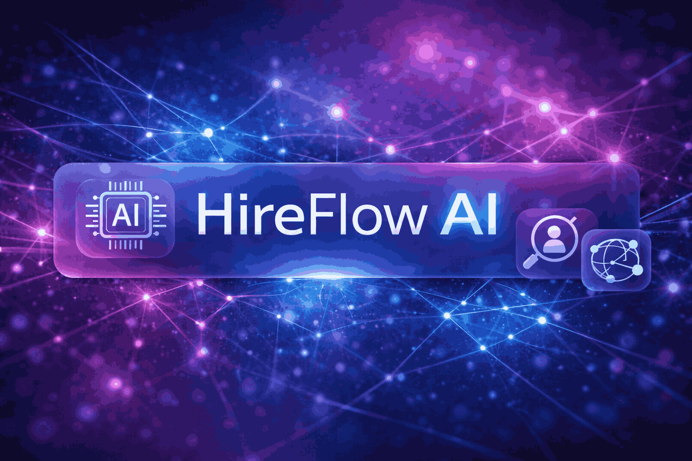
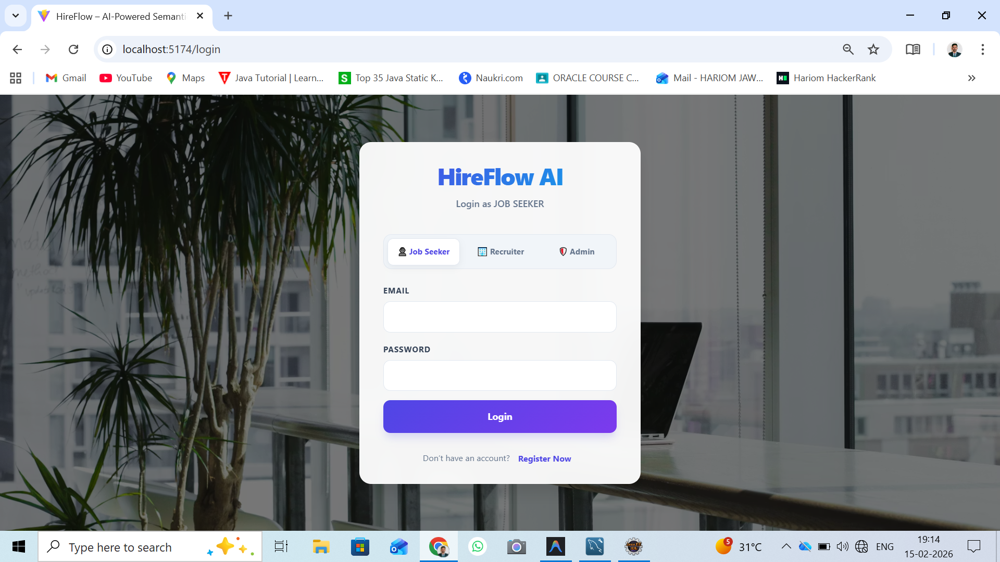
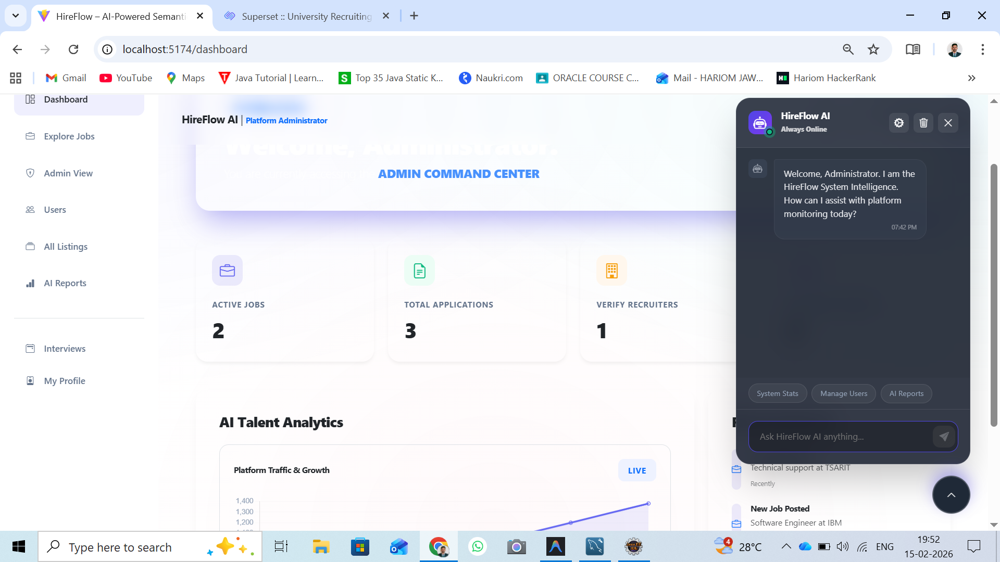
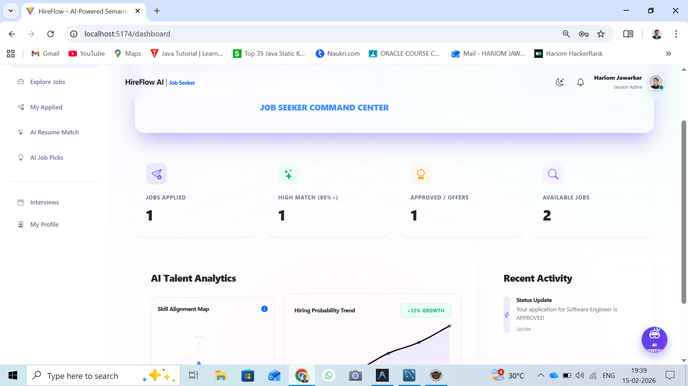
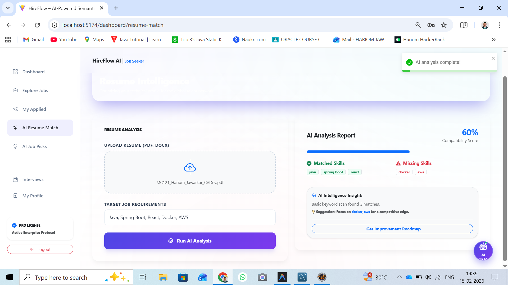
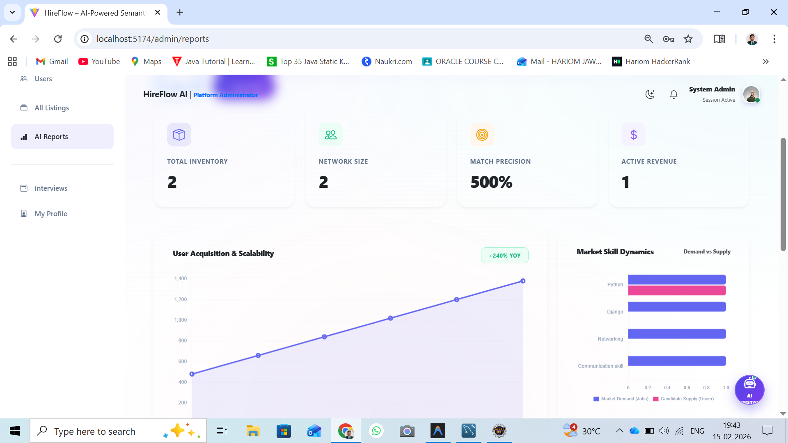
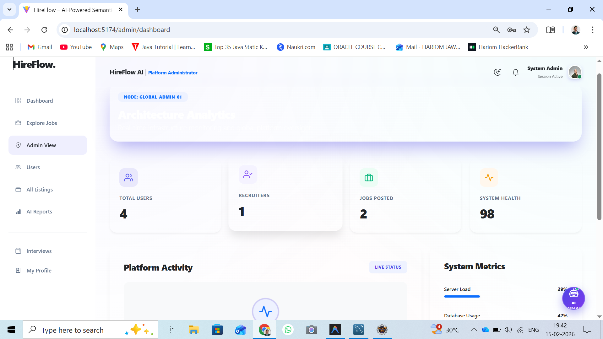
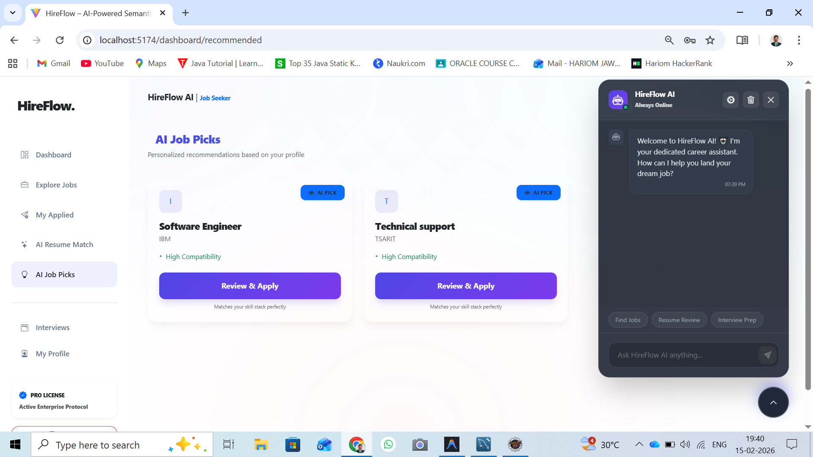
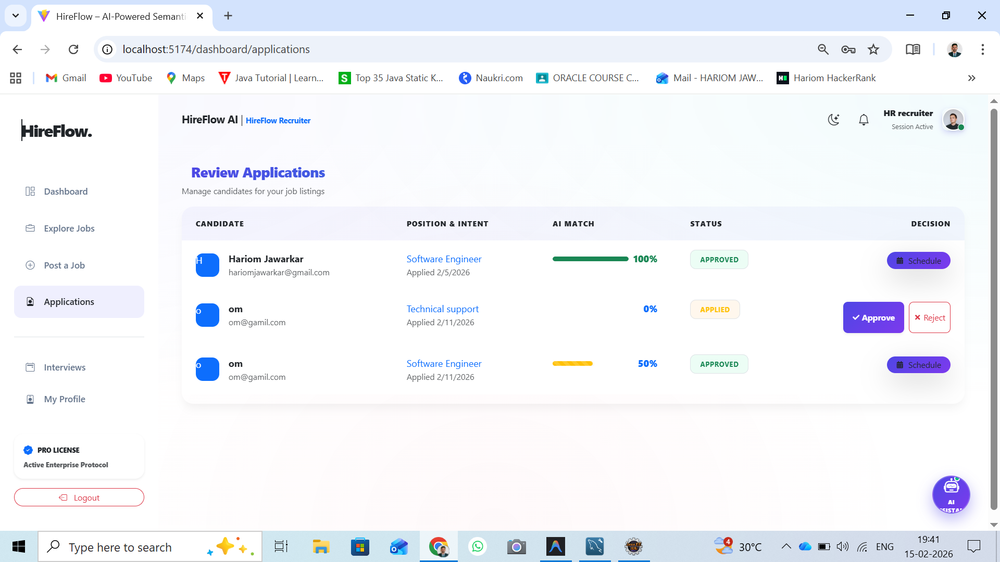

# HireFlow – AI-Powered Talent Intelligence 🚀



HireFlow is a next-generation, AI-driven recruitment platform that uses semantic intelligence to bridge the gap between technical talent and world-class product teams.

It empowers recruiters with deep analytics while enabling candidates to showcase their true technical potential through intelligent resume analysis and AI-powered job matching.

---

# 🖥️ Platform Preview

## 🔐 Login & Authentication


Secure JWT-based authentication system supporting Admins and Job Seekers.

---

## 📊 Admin Intelligence Dashboard


Executive-level analytics including:

- Hiring funnel insights  
- Candidate pipeline tracking  
- Skill demand heatmaps  
- Recruitment performance KPIs  

---

## 👤 Candidate Dashboard


Personalized job insights including:

- Profile strength score  
- AI job matches  
- Resume ranking  
- Application tracking  

---

# 🧠 AI Talent Matching Engine

## 📄 Resume Analysis


AI parses resumes to extract:

- Skills  
- Experience  
- Projects  
- Education  
- Tech stack  

---

# 📈 Executive Intelligence & Analytics

## 📊 Analytics Overview


Real-time dashboards displaying:

- Active candidates  
- Open roles  
- Hiring velocity  
- Selection ratios  

---

## 🧾 Reports & Insights


Downloadable reports for:

- Recruitment performance  
- Talent acquisition metrics  
- Department hiring stats  

---

# 🧑‍💼 Role-Based Access Control

## 🛠️ Admin Panel


Admins can:

- Post jobs  
- View analytics  
- Manage candidates  
- Track hiring pipeline  

---

## 👨‍💻 Job Seeker Panel


Candidates can:

- Upload resumes  
- View AI matches  
- Apply to jobs  
- Track applications  

---

# ✨ Glassmorphic UI Experience

## 🌌 Premium Visual Design


Features:

- Frosted glass cards  
- Blur overlays  
- Neon highlights  
- Dark atmospheric theme  

---

# 🏗️ System Architecture

- **Frontend:** React 18 + Vite (Glassmorphic UI)  
- **Backend:** Spring Boot 3 (Java 17)  
- **Database:** MySQL  
- **Authentication:** JWT  
- **API Communication:** Axios  
- **AI Engine:** Resume parsing + semantic matching logic  

---

# 🚦 Getting Started: Run Commands

Follow these steps to run the project locally.

---

## 1️⃣ Step 1: Spring Boot Backend

Core platform logic, APIs, and database integration.

### Prerequisites

- MySQL installed and running  
- Create database:

```sql
CREATE DATABASE hireflow;
```

---

### Run Backend

```bash
cd hireflow-ai-backend/hireflow-ai-backend

./mvnw clean install

./mvnw spring-boot:run
```

Backend runs at:

http://localhost:8080

---

## 2️⃣ Step 2: React Frontend

High-fidelity glassmorphic user interface.

```bash
cd hireflow-frontend

npm install

npm run dev
```

Frontend runs at:

http://localhost:5173

---

# 📊 Infrastructure Status

| Component | Technology | Port |
|-----------|-------------|------|
| Core API | Spring Boot 3 / Java 17 | 8080 |
| Frontend | React 18 / Vite | 5173 |
| Database | MySQL | 3306 |

---

# 🛠️ Key Features

- AI Resume Analysis  
- Semantic Talent Matching  
- Executive Hiring Analytics  
- Role-Based Dashboards  
- JWT Authentication  
- Glassmorphic Premium UI  
- Real-Time Data Insights  

---

# 📂 Project Structure

```
hireflow/
│
├── hireflow-ai-backend/
├── hireflow-frontend/
│
├── screenshots/
│   ├── login.png
│   ├── admin_dashboard.png
│   ├── candidate_dashboard.png
│   ├── resume_analysis.png
│   ├── semantic_matching.png
│   ├── analytics_overview.png
│   ├── reports.png
│   ├── admin_panel.png
│   ├── jobseeker_panel.png
│   ├── glass_ui_1.png
│   └── glass_ui_2.png
│
├
└── README.md
```

---


Workflow:

Login → Upload Resume → AI Match → Dashboard

---

# 🚀 Future Enhancements

- LLM-based resume feedback  
- Video resume analysis  
- ATS integration  
- Company intelligence dashboards  

---

# 👨‍💻 Author

Hariom Jawarkar  
Java Full Stack Developer | AI-Driven Systems Builder

---
